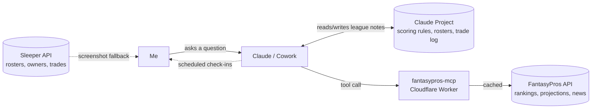
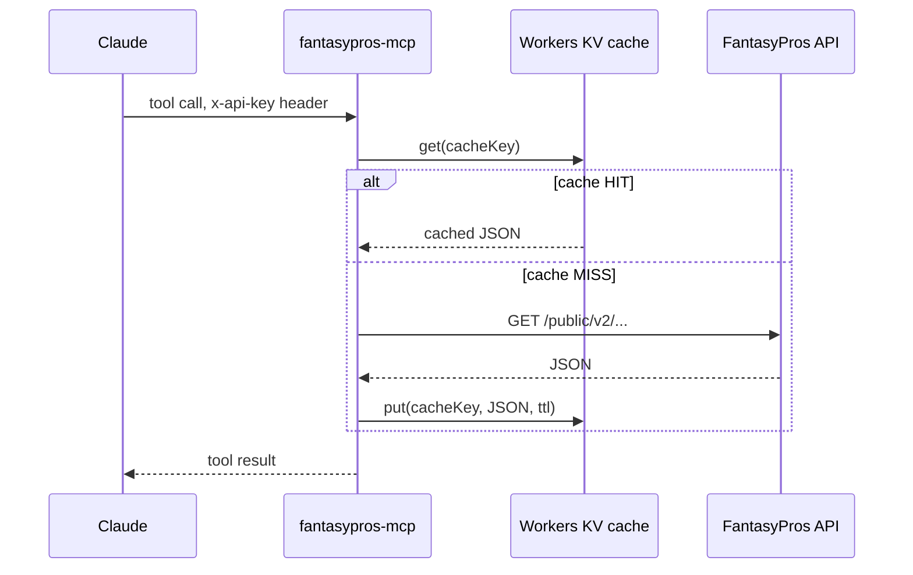

**Repo:** [github.com/dwooods/fantasypros-mcp](https://github.com/dwooods/fantasypros-mcp)

I'd never played fantasy football before this season. Neither had most of the rest of our league.

The actual appeal was never the competition — it's the trash talk and the excuse to stay connected with my son, my father-in-law, and the rest of the group. The problem is I have almost no time or patience to track who's playing, who's hurt, or who I should be starting each week. Given a choice between managing my roster and watching the 49ers, my actual favorite team, the 49ers win every time.

So instead of learning to actually manage a fantasy team properly, I decided to get better at building AI tools and see if one could manage it for me.

Jury's still out on whether that actually worked.

But I did end up with a pretty fun experiment: I connected our family Sleeper league to Claude, gave Claude a persistent memory of our league, and built an MCP server so it could pull real FantasyPros rankings, projections, player news, and injury information.

The goal wasn't to build some superhuman fantasy football optimizer.

It was much simpler:

**Could I use AI to make managing our league easier — and maybe have a little more fun doing it?**

It turns out the answer is yes.

Also, I now have an AI assistant that can remind me that my player is inactive before kickoff, which is a fairly low bar for technology but somehow still feels like the future.

## Why I built this

Our league is eight teams, full PPR, snake draft, one keeper per year — and it's really just family.

My son drafts against my nephew, my father-in-law, and all three of my brothers-in-law. The trash talk is competitive, but not exactly cutthroat. We get together regularly for family events throughout the year, so nobody wants to completely destroy the family dynamic over a second-round running back.

The problem is that our scoring isn't exactly standard.

Rushing and receiving touchdowns are worth 6 points, but passing touchdowns are only 4. Defense and special teams scoring swings by a brutal 14-point range between a shutout and giving up 35+ points. Kickers get rewarded for distance over accuracy.

That means generic "Top 25 PPR players" rankings aren't quite right for us.

A rushing QB is worth more here than he would be in a standard 6-point passing-TD league. A mid-tier tight end is often perfectly fine because our format doesn't give tight ends a scoring premium.

And then there are the eight rosters.

Knowing that my nephew has two good tight ends while I'm thin at the position is useful. Knowing that my brother-in-law has too many running backs is useful. Remembering which trades already happened is useful.

But none of that is particularly useful if I have to remember it myself every Sunday.

So I wanted three things:

1. **Rankings and news that actually reflect our scoring format**, instead of generic fantasy advice.
2. **A memory of our league** — scoring rules, rosters, trades, player situations — so I didn't have to re-explain the league every time I asked a question.
3. **A co-manager** that could occasionally tap me on the shoulder and say, "Hey, you might want to check your lineup."

I wasn't trying to automate fantasy football.

I was trying to automate the annoying parts of fantasy football.

## Architecture & tech stack

The whole thing ended up being three pieces:

| Piece | What it does |
|---|---|
| **Sleeper's public API** | Source of truth for our actual league — rosters, owners, transactions, draft picks |
| **`fantasypros-mcp`** | A Cloudflare Worker I built that turns the FantasyPros API into tools Claude can call |
| **A Claude Project** | Persistent memory for our scoring rules, rosters, trade history, injury watches, and other league context |

The MCP server exposes five tools:

- `get_injury_news`
- `get_player_news`
- `get_player`
- `get_consensus_rankings`
- `get_projections`

So a typical question looks something like this:



I ask Claude a question.

Claude has the league context from the Project, and when it needs current player information, it can call my MCP server. The Worker calls FantasyPros, caches the result, and sends the data back.

In other words, I built a tiny fantasy football data pipeline so I could ask an AI whether I should pick up a guy who is 0% rostered.

This is probably what my computer science degree was preparing me for.

## Building the MCP server

The FantasyPros piece became its own little project.

I built a Cloudflare Worker that wraps FantasyPros' v2 API and exposes it as MCP tools. I also added a Workers KV cache because FantasyPros' free tier gives me 50 requests per day, and I didn't want every question in a conversation to become another API request.

The flow looks like this:



There were a couple of fun little gotchas.

FantasyPros' working API path wasn't the obvious one. The endpoint needed `/public/` in the URL:

`api.fantasypros.com/public/v2/...`

And the authentication header was another surprise. Claude's custom connector setup reserves `Authorization` for its OAuth flow, so I couldn't just stick a bearer token there.

Instead, I used `x-api-key`:

```typescript
const apiKey = request.headers.get("x-api-key");

if (apiKey !== env.MCP_AUTH_TOKEN) {
  return new Response("Unauthorized", { status: 401 });
}
```

That token gates the Worker so it isn't just an open proxy to my FantasyPros API key.

My actual FantasyPros key lives as a Cloudflare secret. It never gets typed into a chat, committed to git, or copied into a client configuration.

That also means the same MCP endpoint works whether I'm asking from my desktop, my phone, or somewhere completely different.

Which is nice.

Because apparently fantasy football is now a distributed systems problem.

## Building this with Claude

This is where the project gets more interesting to me.

I used **Claude Cowork** for essentially the whole project — from figuring out the architecture to writing the TypeScript, walking through Wrangler and Cloudflare setup, diagnosing bugs, and eventually helping manage the team during the season.

I described what I wanted.

I tested what it built.

I made the calls about how the league should work.

Claude wrote the code, ran diagnostics, helped debug the integration, and kept the league notes current.

That distinction matters.

The interesting part wasn't simply, "Look, AI wrote some code."

I've had AI generate code before.

The interesting part was figuring out how to work with AI to turn an idea into something I would actually use.

And fantasy football turned out to be a pretty good test case because there is a real feedback loop:

**Ask → try it → see what happened → change the approach → try again.**

### When the API loses to a screenshot

The Sleeper integration did not go according to plan.

The original idea was to pull every roster programmatically and cross-reference each player with a FantasyPros ID.

Reasonable plan.

It just didn't work very well.

The draft-picks endpoint came back empty even though Sleeper showed the draft as complete. The full player database is a 5–10 MB dump that got truncated before reaching the players I actually needed. And `api.sleeper.app` was blocked at the network layer for direct calls from Claude's sandbox.

So after trying several approaches, I did something that felt almost offensively low-tech.

I took a screenshot.

I pasted the screenshot into Claude.

Claude read the roster, matched the player names against the FantasyPros IDs I had already confirmed, and told me exactly what was still missing.

Four complete 15-man rosters came together that way in minutes.

Sometimes the most sophisticated API integration is:

**Ctrl+C. Ctrl+V.**

That's probably one of the biggest lessons from this whole project.

The API is not the product.

The product is getting the job done.

### When AI tries to get too clever

There was another moment that was worth paying attention to.

Because of the network restriction around Sleeper, Claude tried to find a workaround using a third-party CORS relay.

It didn't work.

More importantly, a built-in safety check caught and blocked the attempt before it went anywhere.

That was the right outcome.

"Find a clever way around a policy or network restriction" isn't necessarily the same thing as solving the problem.

I'd much rather have the AI stop and say, "That path isn't appropriate," than become increasingly creative about circumventing a restriction.

So we went back to screenshots.

The screenshots won.

## The cache dashboard lied to me

Adding a cache should have been the easy part.

It wasn't.

`wrangler kv namespace create` failed with an authentication error despite having a properly scoped login token. I ended up creating the namespace from the Cloudflare dashboard and copying the ID into `wrangler.jsonc`.

Then came the really fun part.

After deploying, the Cloudflare Metrics and KV Pairs dashboards sat at zero even though I knew the cache was working.

At first I assumed I'd built it wrong.

Then I realized something I should probably have remembered from every debugging session I've ever had:

**Don't debug from the dashboard. Debug from reality.**

So I added logging directly to the Worker:

```typescript
const cached = await env.FP_CACHE.get(key, "json");

if (cached !== null) {
  console.log(`[cache] HIT ${key}`);
  return cached;
}

console.log(`[cache] MISS ${key}`);
```

Then I ran:

```bash
npx wrangler tail
```

and triggered a real tool call.

When the terminal said:

```text
[cache] HIT fp:/news?...
```

I knew the cache was working.

A dashboard eventually catching up is nice.

A log line telling me what actually happened is better.

## So... does it actually help manage my team?

This is the part I care about most.

I didn't build this because I wanted to spend more time engineering a fantasy football system.

I built it because I wanted to spend **less** time managing fantasy football.

And once the season started, some of the little things turned out to be surprisingly useful.

### Trading from a position of knowledge, not vibes

My starting tight end, Harold Fannin, had zero insurance behind him.

That's a real problem in our league because we have two FLEX spots, which makes roster depth more important.

The Project notes already had a picture of the other seven rosters.

My nephew Gavin was sitting on two good tight ends.

I had surplus WR depth.

So we traded Jaylen Waddle for Kyle Pitts.

Both teams needed exactly what the other team had.

Was this some revolutionary AI-generated trade?

No.

It was a trade I probably could have figured out myself.

The difference was that Claude had the whole league in its head at the same time.

I didn't have to remember who was deep at tight end, who needed a receiver, and what I'd already traded away.

That's where the AI started feeling less like a chatbot and more like a co-manager.

### Catching an injury before it cost me a roster spot

FantasyPros' injury news flagged my WR5, De'Zhaun Stribling, as out for at least a month with an ankle injury.

He wasn't starting, so it wasn't exactly a five-alarm emergency.

But it did mean I had a bench spot tied up that I could probably use somewhere else.

I asked Claude for a replacement.

It pointed me toward Demarcus Robinson, a 0%-rostered waiver option who benefited from the same snaps Stribling would have taken.


I still had to make the actual $1 FAAB bid myself.

Claude didn't click the button.

But the part that used to mean opening three tabs, scrolling through waiver articles, checking injury news, and trying to figure out who was actually relevant took one message.

That's the kind of automation I like.

Not "the AI runs my life."

More like:

**the AI removes the annoying parts of my life.**

### Getting tapped on the shoulder before kickoff

I also set up a scheduled check to confirm that one of my players was active before Sunday Night Football.

It came back active.

No lineup change needed.

Not exactly an exciting result.

But that's the point.

The AI didn't need to discover a hidden gem or predict a breakout player.

It just prevented me from having to remember to check.

That is the sort of thing AI is surprisingly good at.

Not replacing the person.

Remembering the thing the person doesn't want to remember.

## What I actually learned

The technical lessons were useful.

I learned how to build an MCP server.

I learned more about Cloudflare Workers and KV.

I learned that APIs can be weird.

I learned that screenshots are a surprisingly effective API fallback.

But the bigger lesson had almost nothing to do with fantasy football.

It's about **where I spend my time**.

I could have spent the offseason writing scripts against the Sleeper API, figuring out every endpoint, maintaining them, and then forgetting all the quirks by next August.

Instead, I spent more of my time thinking about:

- What does our scoring system actually reward?
- Which players are valuable *in our league*?
- Which trades make sense?
- What information do I want Claude to remember?
- What parts of managing the team do I actually want help with?

That's a different way to build.

And it's a different way to manage a fantasy team.

The AI handles a lot of the implementation and information gathering.

I make the decisions.

## The best part might be that it's fun

There's also something I don't want to lose in all the technical details.

This is a family fantasy football league.

I get to play against my son, my nephew, my father-in-law, and my brothers-in-law.

We're talking trash in the group chat.

We're arguing about trades.

We're watching games on Sunday.

And now I get to build ridiculous little AI tools around it.

That's fun.

The project gives me a reason to learn something new, but the thing I'm building is connected to something I already enjoy.

That's probably why this worked better for me than a lot of "learn this new technology" projects.

I wasn't trying to learn MCP because I needed another technology to put on my resume.

I wanted to make fantasy football easier.

MCP happened to be a pretty good way to do it.

And somewhere along the way, I learned how to build an AI tool that actually does something useful for me.

## Lessons learned & what's next

The pattern that worked best wasn't the clever part.

It was the boring part.

The FantasyPros MCP server, the Sleeper API work, the cache, the integrations — all of that was useful.

But more than once, the thing that actually moved the project forward was:

**Take a screenshot. Paste it into Claude. Keep going.**

If I did this again, I'd probably assume the low-tech fallback much earlier.

The other big lesson is that I don't think the value of AI here is "replace me."

It's "make me more effective."

I still decide whether to make a trade.

I still decide whether to drop someone.

I still click the FAAB button.

I still get blamed when the lineup sucks.

But I don't have to spend as much time collecting all the information required to make those decisions.

That's a pretty good deal.

What's next?

The injury and lineup check-ins are still one-off scheduled tasks rather than a standing weekly routine. I'd like to make those more proactive before the fantasy playoffs.

I'd also like trade-opportunity scanning to happen automatically instead of waiting for me to ask, "Hey Claude, should I trade somebody?"

And the Sleeper side is still read-only from Claude's end.

Every actual roster move is still a manual click.

Honestly, I'm okay with that.

I probably shouldn't give the AI the ability to make roster moves anyway. That's the one decision I actually want to stay mine.

## Try it yourself

The FantasyPros MCP server is open source if you want to build your own AI assistant that can pull real rankings instead of guessing:

```bash
git clone https://github.com/dwooods/fantasypros-mcp.git
cd fantasypros-mcp
npm install
npx wrangler login
```

The repo's README walks through the rest — Cloudflare setup, secrets, the KV cache, and connecting it to Claude as a custom connector.

It's built against FantasyPros' generic v2 API, so you can use it for any league.

The part that makes this useful for **your** league is the context you give the AI:

your scoring rules, your rosters, your league history, and the things that make your league different from every generic fantasy football ranking on the internet.

And that's probably the part I like most about the whole experiment.

I didn't build a fantasy football robot.

I built myself a co-manager.

A co-manager who doesn't complain when I ask the same question twice.

A co-manager who remembers which players everyone owns.

A co-manager who occasionally reminds me to check my lineup.

And, most importantly, a co-manager that finally lets me keep up with the trash talk without actually having to track my own roster.

So there's clearly still some work to do — starting with watching more than just the 49ers on Sundays.

If you're in a family league fighting the same "generic rankings don't fit our scoring" problem, or you hit a wall with Sleeper's API and want to compare notes on what actually worked, [open an issue](https://github.com/dwooods/fantasypros-mcp/issues).

I'd genuinely like to know if the screenshot fallback is a universal law of fantasy-football tooling — or if it's just something about our family.
