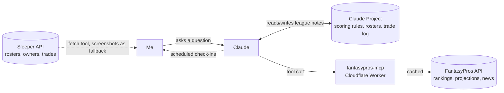

<style>
.featured-image img, .featured-image img.lazyloaded { max-width: 492px; width: 100% !important; }
</style>

I'd never played fantasy football before this season, and the first one was with family.

The actual appeal was never the competition — it's the trash talk and the excuse to stay connected with my son, my father-in-law, and the rest of the group. The problem is I have almost no time or patience to track who's playing, who's hurt, or who I should be starting each week. Given a choice between managing my roster and watching the 49ers, my actual favorite team, the 49ers win every time.

So instead of learning to actually manage a fantasy team properly, I decided to get better at building AI tools and see if one could manage it for me.

Jury's still out on whether that actually worked.

Through week 3, I'm 1–2 and sitting fifth in an eight-team league.

But I did end up with a pretty fun experiment: I connected our family Sleeper league to Claude, gave Claude a persistent memory of our league, and built an MCP server so it could pull real FantasyPros rankings, projections, player news, and injury information. The goal wasn't to build some superhuman fantasy football optimizer. It was much simpler: **could I use AI to make managing our league easier — and maybe have a little more fun doing it?** It turns out the answer is yes.

Also, I now have an AI assistant that can remind me that my player is inactive before kickoff, which is a fairly low bar for technology but somehow still feels like the future.

## Why I built this

Our league is eight teams, full PPR, snake draft, one keeper per year — and it's really just family. My son drafts against my nephew, my father-in-law, my wife's three cousins, and one of the cousins' sons. The trash talk is competitive, but not exactly cutthroat. We get together regularly for family events throughout the year, so nobody wants to completely destroy the family dynamic over a second-round running back.

The problem is that our scoring isn't exactly standard. Rushing and receiving touchdowns are worth 6 points, but passing touchdowns are only 4. Defense and special teams scoring swings by a brutal 14-point range between a shutout and giving up 35+ points. Kickers get rewarded for distance over accuracy. That means generic "Top 25 PPR players" rankings aren't quite right for us. A rushing QB is worth more here than he would be in a standard 6-point passing-TD league, and a mid-tier tight end is often perfectly fine because our format doesn't give tight ends a scoring premium.

And then there are the eight rosters. Knowing that my nephew has two good tight ends while I'm thin at the position is useful. Knowing that one of my wife's cousins has too many running backs is useful. Remembering which trades already happened is useful. But none of that is particularly useful if I have to remember it myself every Sunday.

So I wanted three things:

1. **Rankings and news that actually reflect our scoring format**, instead of generic fantasy advice.
2. **A memory of our league** — scoring rules, rosters, trades, player situations — so I didn't have to re-explain the league every time I asked a question.
3. **A co-manager** that could occasionally tap me on the shoulder and say, "Hey, you might want to check your lineup."


I wasn't trying to learn MCP because I needed another technology to put on my resume. I wanted to make fantasy football easier, and MCP happened to be a pretty good way to do it.

## Architecture & tech stack

The whole thing ended up being three pieces:

| Piece | What it does |
|---|---|
| **Sleeper's public API** | Source of truth for our actual league — rosters, owners, transactions, draft picks |
| **`fantasypros-mcp`** | A Cloudflare Worker I built that turns the FantasyPros API into tools Claude can call |
| **A Claude Project** | Persistent memory for our scoring rules, rosters, trade history, injury watches, and other league context |

So a typical question looks something like this:


```mermaid
graph LR
    Sleeper[(Sleeper API<br/>rosters, owners, trades)] -. fetch tool, screenshots as fallback .-> Me
    Me[Me] -->|asks a question| Claude[Claude]
    Claude <-->|reads/writes league notes| Project[(Claude Project<br/>scoring rules, rosters, trade log)]
    Claude -->|tool call| MCP[fantasypros-mcp<br/>Cloudflare Worker]
    MCP -->|cached| FP[(FantasyPros API<br/>rankings, projections, news)]
    Claude -. scheduled check-ins .-> Me
```

Net result: I built a tiny fantasy football data pipeline so I could ask an AI whether I should pick up a guy who is 0% rostered.

This is probably what my computer science degree was preparing me for.

## Building this with Claude

I used Claude for essentially the whole project — from figuring out the architecture to writing the TypeScript, walking through Wrangler and Cloudflare setup, diagnosing bugs, and eventually helping manage the team during the season. I described what I wanted, I tested what it built, and I made the calls about how the league should work. Claude wrote the code, ran diagnostics, helped debug the integration, and kept the league notes current. Fantasy football turned out to be a pretty good test case because there is a real feedback loop: **Ask → try it → see what happened → change the approach → try again.**

### The notes file is the real product

The part I'd steal for any project isn't the server. It's the notes file the Claude Project runs on. It's one long document, and every section has a job:

- **Rules, checked against the source.** The exact scoring rules, pulled from Sleeper's own settings. The notes file is the source of truth for scoring, not a synced copy of it.
- **What the rules reward.** Nine plain-English takeaways, like "stream DEF by matchup" and "don't over-rank pocket-passer QBs." This is what makes Claude advise for our league instead of generic PPR.
- **Rosters, with a refresh rule.** All eight teams, plus instructions for re-verifying them. The first version came from draft-day memory and was wrong: it said one team lacked a workhorse RB, and it didn't. I caught it by pulling the live roster.
- **A running log.** Trades and injury watches, so I don't have to remember what already happened. The Waddle-for-Pitts trade is a one-line entry, and so is Stribling's ankle; both show up below.
- **Tone.** It's a family league, so trade talk stays warm, not cutthroat.

Before a real trade offer, every few weeks, and before the deadline, I say "refresh the team notes" and Claude re-verifies and rewrites that section. Swap in your own project and the structure holds: what are the rules, what do they reward, what's the current state, when was it last checked, and what should the AI never do.

### Getting the rosters in: when the API loses to a screenshot

The notes need all eight rosters, and getting them in did not go according to plan. The original idea was to pull every roster programmatically from Sleeper and cross-reference each player with a FantasyPros ID. Reasonable plan. It just didn't work very well.

The full player database is a multi-megabyte dump that got cut off before reaching the players I actually needed. So after trying several approaches, I did something that felt almost offensively low-tech.

I took a screenshot.

I pasted it into Claude. Claude read the roster, matched the player names against the FantasyPros IDs I had already confirmed, and told me exactly what was still missing. Four complete 15-man rosters came together that way in minutes, and I filled in the remaining gaps the same way later. Sometimes the most sophisticated API integration is:

**Ctrl+C. Ctrl+V.**

That's probably one of the biggest lessons from this whole project.

The API is not the product.

The product is getting the job done.

Since then, Claude has been reading Sleeper's API through a fetch tool, so the screenshots are mostly retired.

## The plumbing: the MCP server

The FantasyPros side is a small Cloudflare Worker that wraps FantasyPros' v2 API and exposes it as MCP tools, with a Workers KV cache in front because the free tier gives me 50 requests per day and I didn't want every follow-up question to burn one. The README covers the setup. Two gotchas are worth knowing about.

First, FantasyPros' working API path wasn't the obvious one: the URL needs `/public/` (`api.fantasypros.com/public/v2/...`). Second, Claude's custom connector reserves `Authorization` for its OAuth flow, so I couldn't just stick a bearer token there. I used `x-api-key` instead:

```typescript
const apiKey = request.headers.get("x-api-key");

if (apiKey !== env.MCP_AUTH_TOKEN) {
  return new Response("Unauthorized", { status: 401 });
}
```

That token gates the Worker so it isn't just an open proxy to my FantasyPros API key. My actual FantasyPros key lives as a Cloudflare secret. It never gets typed into a chat, committed to git, or copied into a client configuration. That also means the same MCP endpoint works whether I'm asking from my desktop, my phone, or somewhere completely different — which is nice. Because apparently fantasy football is now a distributed systems problem.

The cache should have been the easy part, but `wrangler kv namespace create` failed with an authentication error despite a properly scoped login token. I created the namespace from the Cloudflare dashboard instead and copied the ID into `wrangler.jsonc`. The dashboard was slow to show any traffic, so I confirmed the cache was working from the terminal: `npx wrangler tail`, one real tool call, and a `[cache] HIT` line.

## So... does it actually help manage my team?

The only question left was whether any of this actually made managing my team easier. I built it to spend **less** time on fantasy football, not more, and in practice that mostly means I open the Sleeper app less: Claude reads the league through the APIs, so the research happens before I ever tap anything. And once the season started, some of the little things turned out to be surprisingly useful.

### Trading from a position of knowledge, not vibes

My starting tight end, Harold Fannin, had zero insurance behind him — a real problem in our league because we have two FLEX spots, which makes roster depth more important. The Project notes already had a picture of the other seven rosters: my nephew Gavin was sitting on two good tight ends, and I had surplus WR depth. So we traded Jaylen Waddle for Kyle Pitts. Both teams needed exactly what the other team had.

Was this some revolutionary AI-generated trade? No. It was a trade I probably could have figured out myself. The difference was that Claude had the whole league in its head at the same time — I didn't have to remember who was deep at tight end, who needed a receiver, and what I'd already traded away. That's where the AI started feeling less like a chatbot and more like a co-manager. Pitts never did much for me, and I no longer have him, which is a good reminder that a trade making sense on paper and a trade working out are two different things.

### Catching an injury before it cost me a roster spot

FantasyPros' injury news flagged my WR5, De'Zhaun Stribling, as out for at least a month with an ankle injury. He wasn't starting, so it wasn't exactly a five-alarm emergency, but it did mean I had a bench spot tied up that I could probably use somewhere else. I asked Claude for a replacement, and it pointed me toward Demarcus Robinson, a 0%-rostered waiver option who benefited from the same snaps Stribling would have taken.


I still had to make the add and drop myself in the Sleeper app. Claude didn't click the button. But the part that used to mean opening three tabs, scrolling through waiver articles, checking injury news, and trying to figure out who was actually relevant took one message.

## Lessons learned & what's next

The lesson I'd generalize has almost nothing to do with fantasy football. It's about **where I spend my time**.

I could have spent the offseason writing scripts against the Sleeper API, figuring out every endpoint, maintaining them, and then forgetting all the quirks by next August. Instead, I spent more of my time thinking about which trades make sense and which parts of managing the team I actually wanted help with, and about what Claude needed to know to answer either one.

FantasyPros has an official, hosted MCP server that does more than mine does, and it was already live when I started: their MCP docs are dated September 1st, and I began the Worker on September 5th. If I'd found it first, I probably would have just used theirs, and I'll likely switch my own workflow over at some point. The wrapper itself is probably redundant now, but what I built it with transfers: the Worker, the MCP mechanics, the auth header, and the caching layer.

If I did this again, I'd assume the low-tech fallback much earlier. What hasn't changed is who makes the calls.

I still decide whether to make a trade.

I still decide whether to drop someone.

I still click the add and drop buttons.

I still get blamed when the lineup sucks.

But I don't have to spend as much time collecting all the information required to make those decisions. That's a pretty good deal.

What's next? The injury and lineup check-ins are still one-off scheduled tasks rather than a standing weekly routine, and I'd like to make those more proactive before the fantasy playoffs. I'd also like trade-opportunity scanning to happen automatically instead of waiting for me to ask, "Hey Claude, should I trade somebody?" And the Sleeper side is still read-only from Claude's end, so every actual roster move is still a manual click. Honestly, I'm okay with that. I probably shouldn't give the AI the ability to make roster moves anyway; that's the one decision I actually want to stay mine.

## Want to try it?

The FantasyPros MCP server is [open source on GitHub](https://github.com/dwooods/fantasypros-mcp), and the README walks through the Cloudflare setup, secrets, the KV cache, and connecting it to Claude.

```bash
git clone https://github.com/dwooods/fantasypros-mcp.git
cd fantasypros-mcp
npm install
npx wrangler login
```

If you're in a family league fighting the same "generic rankings don't fit our scoring" problem, or you hit a wall with Sleeper's API, [open an issue on the repo](https://github.com/dwooods/fantasypros-mcp/issues) — I'd genuinely like to compare notes.

I'd also set up a scheduled check to make sure one of my players was active before kickoff. The Sunday Night Football check came back active, so there was nothing left for me to do. The lineup was set, the group chat was still talking trash, my son was in it, and I didn't have to remember a thing.
