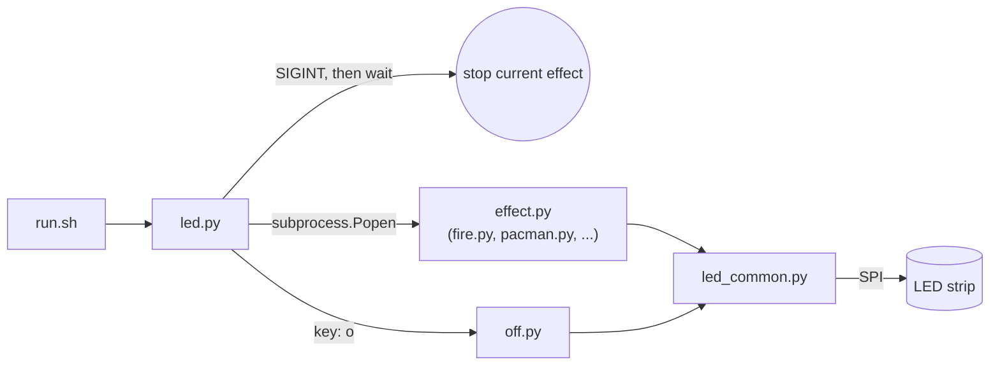

**Repo:** [github.com/dwooods/led-strip](https://github.com/dwooods/led-strip)

I plugged in a strip of addressable LEDs, applied power with no data signal connected, and it started blinking random colors at me. My first thought was "great, it's broken already." Turns out that's not a broken strip — that's an addressable strip (WS2812B/SK6812-family) doing exactly what it does with no data signal telling it what color to be. A plain non-addressable strip would've just lit up one steady color. That random blinking was actually good news, and it's how this project started: not knowing that, and finding out before wiring anything wrong.

Eleven effects, a menu you run from the terminal, and a browser-based simulator later, here's how it went — including the part where I let an AI write most of the code.

## Why I built this

I've got a CS degree, and my first job out of school was writing code — but coding itself was never the part I loved. What I love is building things and solving problems, and for a long time those two facts pulled against each other: I'd have an idea, and then the implementation would eat every bit of time and patience I had for it. I've done LED strip projects before, without AI, and it took days to get something simple working — a lot of web searching, trying to bend someone else's example to fit my wiring, running out of steam before it was actually done. Projects like that tend to die in a "works on my desk, nobody else could reproduce it" state.

This is also the first Pi project I've set up with a real project behind it, documenting decisions as I went instead of accumulating a folder of scripts I'd forget the reasoning for in a month. This time I wanted two things: actually finish it, and make it something someone else could clone and run themselves. Part of why I'm writing this blog at all is to get better at that — communicating what I built and why, not just building it.

## Architecture & tech stack

**Hardware:** Raspberry Pi 5, SK6812/WS2812B-compatible addressable strip, external 5V supply (never the Pi's own 5V rail — a strip like this can pull several amps, more than the Pi's onboard supply is meant to source), shared ground across everything, data line on GPIO10/MOSI. The GPIO header isn't wired point-to-point, though — it goes Pi → ribbon cable → an Adafruit T-Cobbler Plus mounted on a half-size breadboard, which breaks the 40 pins out to breadboard rows. The strip's data and ground leads land on those rows instead of jumping straight into the Pi's header, which made it a lot easier to move things around while I was still figuring out the wiring.


**Software:** Python 3, the [`rpi5-ws2812`](https://pypi.org/project/rpi5-ws2812/) package, a `bash` launcher script, and a vanilla JS/HTML/CSS browser simulator with no build step.

The Pi 5 is the reason this couldn't just follow any of the existing LED-strip tutorials. Every one of them points you at `rpi_ws281x` or Adafruit's `neopixel` library, and neither works on a Pi 5. Previous Pi boards let those libraries talk straight to GPIO memory to hit the strip's tight timing requirements; the Pi 5 moved GPIO handling to a separate chip called RP1, and that direct-register trick just doesn't reach the pins anymore. It doesn't error loudly — it just doesn't work, which is worse.


If a Pi 5 GPIO tutorial predates the Pi 5 (most do), assume it needs a translation step. For this project, the fix was routing the LED data line over **hardware SPI** instead of PWM/DMA, using `rpi5-ws2812` — the RP1 chip handles SPI natively.


Here's how the pieces talk to each other:



`run.sh` (symlinked as `ledstrip` on `PATH`) just erases the "was it `source venv/bin/activate` first or `cd` first?" friction — it creates the venv if one doesn't exist yet and launches the menu.

### Tools & AI assist

I used **Claude Cowork** for the entire build — not "helped with a tricky function." I didn't write any code, commit anything, manage the repo, or keep notes on what we'd done. Cowork did all of it. Concretely:

- Before I'd written a line of code, I sent photos of the strip and power setup. Cowork diagnosed the blinking-on-power behavior as an addressable strip's calling card — that's what kept me from guessing wrong on wiring.
- It researched the Pi 5 RP1/GPIO issue and the SPI fix, and wrote all eleven effects, `led.py`, `led_common.py`, and `off.py`.
- Every time something broke or I wasn't sure how to proceed, Cowork did the research and issue investigation — that's the part that used to cost me days, gone.
- The browser simulator wasn't my idea — Cowork suggested it partway through, as a way to preview effects without hardware in front of me.
- It handled every `git` operation end-to-end — commits, pushes, all of it — and wrote `JOURNEY.md` itself, the retrospective write-up of the whole build, then handed me the exact commands to paste into my Pi's SSH session to publish it. If you read that file, you're reading something Cowork wrote about a project Cowork built, which felt worth admitting rather than passing off as my own narration.

How low the barrier got: my 13-year-old, who has never written a line of code, sent Cowork a few chat requests of his own and ended up with the Rocket Launch effect in the menu.

I didn't run into a dramatic "confidently wrong" moment worth calling out here — no bug it introduced that I had to catch and fix myself. The real friction was architectural growing pains as the design evolved (more on that below), not AI mistakes. What changed was where my time went: instead of losing days to syntax, library research, and debugging, I spent it testing on real hardware, deciding what to build next, and pivoting when something didn't work. That's a genuinely different way to work than the "days of web searching" version of this project I've attempted before.

## Key technical insights & challenges

The current structure — one file per effect, a persistent menu, `off`/`quit` as first-class options — is not how this started. It's what the design turned into after hitting real friction, in order:

**1. The monolith got painful fast.** Everything started in one file. Every new LED pattern meant editing that same file again, and it got harder to work in with each addition. The fix was pulling shared setup into its own module and giving every effect its own standalone file:

```python
from rpi5_ws2812.ws2812 import WS2812SpiDriver

LED_COUNT = 60  # set to your strip's actual LED count

def get_strip(brightness: float = 0.5):
    strip = WS2812SpiDriver(spi_bus=0, spi_device=0, led_count=LED_COUNT).get_strip()
    strip.set_brightness(brightness)
    return strip
```

That's the entirety of `led_common.py`. It exists because every effect needs the same two things — LED count and a configured strip object — and this is one place to change either, instead of eleven copies to keep in sync.

**2. One effect at a time, without the menu blocking or the strip getting stuck.** The project started with a single program you'd run and manually kill to try another. That pivoted to a menu that stays running and lets you pick a different effect while one's already going — but early on, killing an effect could leave the strip frozen mid-pattern, a stray lit pixel glowing until the next run. `led.py` fixed this by sending `SIGINT` to the running effect and waiting for it to exit before starting the next one, so each effect's own cleanup gets a chance to run:

```python
def stop_process(proc):
    if proc is not None and proc.poll() is None:
        proc.send_signal(signal.SIGINT)
        proc.wait()
```

Every effect wraps its animation loop the same way — `except KeyboardInterrupt: strip.clear(); strip.show()` — so `led.py` never needs to know anything effect-specific about how to turn one off. That "lights wouldn't turn off" bug is also why `off.py` exists as a dedicated, synchronous one-shot action rather than just another backgrounded effect — turning the strip off shouldn't itself be an animation you have to interrupt.

**3. Ran out of single-digit keys.** Past nine effects, the menu needed a second character set. Rather than jumping to two-digit numbers, new effects pick up letters (`a`, `b`, `c`, ...), and keys are explicit key-name-filename tuples in a `PROGRAMS` list rather than derived from list position — so adding a twelfth effect later can't accidentally change what key `5` does.

## Lessons learned & what's next

If I started over, I'd probably go straight to the one-file-per-effect-plus-menu pattern instead of detouring through the monolith first — though I'm not sure I'd have known to, without hitting the pain of the monolith directly. The pivots came from testing on real hardware and running into real annoyances, not from planning it all upfront.

The bigger lesson is about where my attention went. Not having to write the Python myself meant I spent my time on the actual decisions — what should happen when the lights won't turn off, when do we need letters instead of digits, is a browser simulator worth building — instead of on syntax and library documentation. That's the difference between this project shipping and the version of this project from a few years ago that didn't.

Stepping back, this project is really a compact demo of four things clicking together — Raspberry Pi, IoT-style hardware, programming, and Cowork doing the implementation — and that combination is what's kept me wanting to build the next thing instead of losing steam after one project. That's the actual point of this blog: more of these, written up honestly, as I go.

## Try it yourself

Clone the repo, wire up a strip (external 5V, shared ground, data line to SPI/MOSI), enable SPI in `raspi-config`, and `./run.sh`:

```bash
git clone https://github.com/dwooods/led-strip.git
cd led-strip
./run.sh
```


No hardware handy? Open `simulator.html` in a browser — it's a self-contained port of the same eleven effects, no server or build step required.


If you build on this, hit a bug, or want an effect that isn't here yet, [open an issue](https://github.com/dwooods/led-strip/issues) or send a PR. And if you want the longer, AI-written version of this story, `JOURNEY.md` is in the repo.
